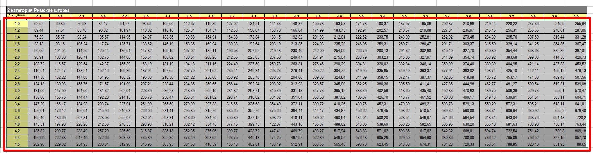
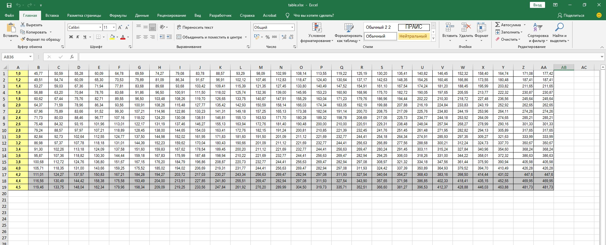
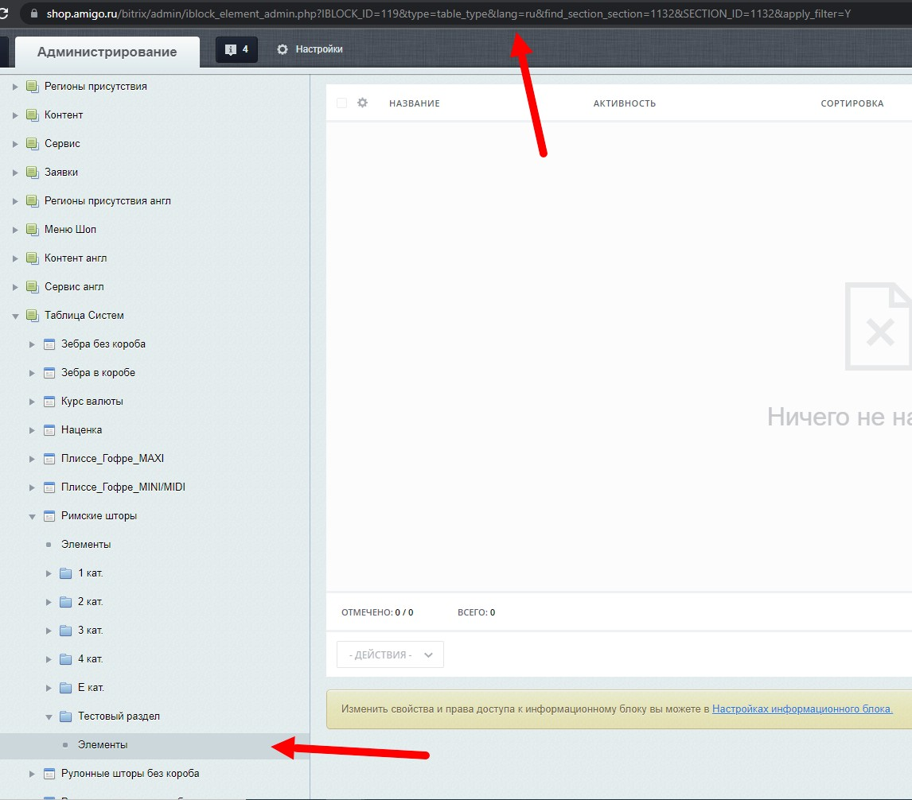
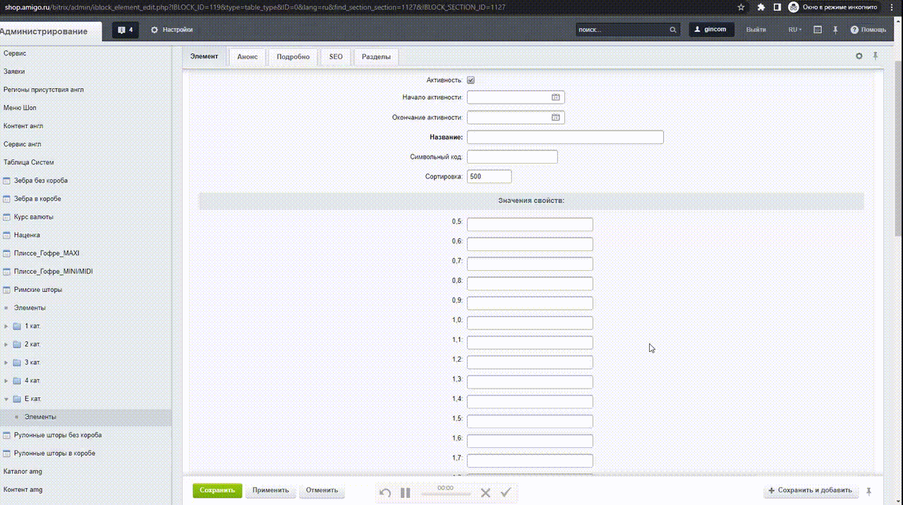
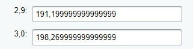

## Как пользоваться:
- Скопируйте данные из таблицы и положите их в файл <a href="https://github.com/onemanpara/Amigo/blob/master/src/main/resources/table.xlsx">src/main/resources/table.xlsx</a> в следующем формате (не берём верхнюю строку с шириной)

P.S. файл с данными приложен, смотрите формат в нём

Должно получиться так:

- Запустите программу
- Введите логин и пароль от админки битрикса
- Введите ссылку на раздел инфоблока, в котором нужно создавать элементы:
  

- Введите числовое значение атрибута, находящееся в input[name=PROP[?]n[0]] у первого свойства:
  

  
# Важно!
Иногда в последние два значение подставляются числа с большой дробной частью. К сожалению, данный баг победить не удалось, нужно вручную проверить последние два значения после создания элементов
  

  
## Демонстрация работы 
Можно посмотреть видео работы <a href="https://skr.sh/vGv3WYeRSiY?a">здесь</a>

Также это видео залито в проекте <a href="https://github.com/onemanpara/Amigo/blob/master/readme_assets/demonstration.mp4">src/main/resources/demonstration.mp4</a>
